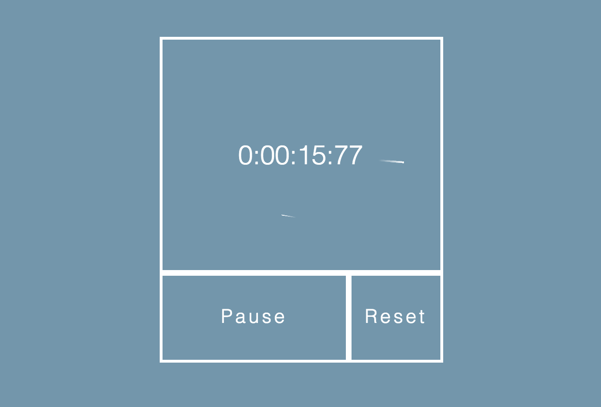

# A Minimal Stopwatch - By Jack & Elias

This is a toy project to create a minimal stopwatch in order to learn TDD and asynchronous testing with QUnit.

## Core Functionality
* Counter displaying hours, seconds, minutes and centiseconds
* Start/Pause button toggles timer on and off
* Reset button resets timer

## Stretch Goals
* Some fancy styling
* Lap timer
* Split timer

## How to Run
You can run the stopwatch in three ways:
1. Clone the repo, and open index.html in your favourite browser.
2. Visit the [repo website](https://github.com/vanillasquad/stopwatch-jack-elias) hosted by github-pages.
3. Download it as an extension from the [chrome extension store](https://chrome.google.com/webstore/detail/stopwatch/dcaienkchlfpbcjkalkhbbcaohecmodp?hl=en-US&gl=GB&authuser=1)

## Screenshot

